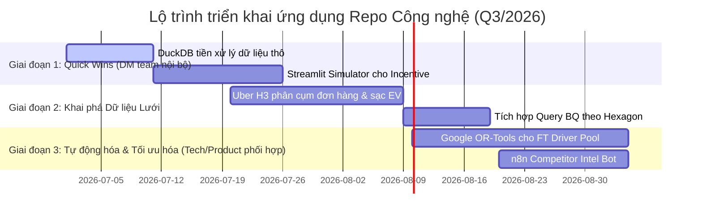

# 📊 TÀI LIỆU CHIẾN LƯỢC: HỆ THỐNG REPO MỞ TỐI ƯU HÓA VẬN HÀNH AHAMOVE 2026
**Tác giả:** Lê Phương Khanh | Driver Management Leader
**Đối tượng:** Operations Team, BI, Product & Tech Team
**Trọng tâm:** Bike (Instant) - Giao ngay 1H, Siêu tốc, Ghép đơn, 4H & Chuyển đổi Selex EV

---

## 📊 Executive Summary
Tài liệu này xác định các **Kho lưu trữ mã nguồn mở (Open-source Repositories)** hàng đầu thế giới trong lĩnh vực Logistics, Operations Research và AI Automation, đồng thời thiết lập phương án **bản địa hóa và ứng dụng thực địa** vào hệ thống vận hành của Ahamove. Mục tiêu cốt lõi là giải quyết bài toán tối ưu hóa chi phí CPO (Cost per Order), nâng cao tỷ lệ hoàn thành đơn hàng (Fulfillment Rate - FR), quản lý vòng đời tài xế (Driver Lifecycle) và đẩy nhanh tốc độ chuyển đổi đội xe điện (EV transition).

### 🎯 Mục tiêu Vận hành & Kinh doanh
*   **S (Situation):** Ahamove đang vận hành các dịch vụ Bike Instant cốt lõi với volume cực lớn nhưng biên lợi nhuận mỏng. Đội ngũ Driver Management (DM) phải liên tục đối mặt với áp lực cân bằng giữa chi phí Incentive (CPO) và chất lượng dịch vụ (SLA / FR / AR), trong bối cảnh cạnh tranh gay gắt từ Grab Express, Be và XanhSM.
*   **C (Complication):** Các công cụ phân tích hiện tại phụ thuộc nhiều vào Excel thủ công hoặc truy vấn BigQuery tĩnh, thiếu khả năng mô phỏng trực quan theo thời gian thực (real-time simulation) và chưa tối ưu hóa phân bổ cung - cầu theo lưới địa lý động, dẫn đến lãng phí ngân sách incentive ở một số khu vực peak-hour.
*   **R (Resolution):** Triển khai tích hợp 5 nhóm công nghệ mã nguồn mở chiến lược nhằm tự động hóa quy trình phân tích, tối ưu hóa thuật toán ghép đơn/điều phối và xây dựng hệ thống tác nhân AI (Agentic AI) tự động hóa thông tin cộng đồng tài xế.

### 📈 Chỉ số Vận hành Cốt lõi (Key KPIs)
*   **Fulfillment Rate (FR):** Target duy trì **>92%** toàn hệ thống.
*   **Acceptance Rate (AR):** Đạt **>85%** thông qua tối ưu hóa dispatch radius.
*   **Cost per Order (CPO):** Giảm **8-12%** nhờ phân phối incentive động theo lưới địa lý.
*   **Driver Churn Rate:** Giảm **15%** ở nhóm tài xế Core (Tier 1 & Tier 2).
*   **EV Conversion Rate:** Chuyển đổi thành công **30%** active drivers sang Selex EV tại vùng phát thải thấp.

---

## 2. KHUNG PHÂN TÍCH (ANALYSIS FRAMEWORK)

### 📊 Phân tích Mô tả (Đánh giá Hiện trạng)
*   **Hạ tầng Vận hành hiện tại:**
    *   Hệ thống đang chạy trên nền tảng dữ liệu Google Cloud / BigQuery để lưu trữ sự kiện vận hành.
    *   Dữ liệu thô từ các sự kiện hủy đơn, active trend (`Analyze bấy bá - phần 2 - active.csv`, `dispatch.csv`) được trích xuất thành file phẳng và phân tích bằng Python cục bộ hoặc Excel.
    *   Quy trình tính thưởng, thiết kế Tiering và lộ trình truyền thông (AhaBenefits, Driver Journey v4.0) đang được thiết kế dạng tài liệu tĩnh, chưa có mô hình giả lập tác động số liệu động trước khi rollout.
*   **Benchmarks Hiệu suất ngành:**
    *   *Grab Express:* Mật độ tài xế phủ cực dày, thuật toán dispatch dựa trên thời gian thực tế di chuyển (ETA-based).
    *   *XanhSM:* Mô hình vận hành đội xe EV tập trung, tối ưu hóa điểm sạc động để giữ chân tài xế.
    *   *Ahamove:* Thế mạnh là ghép đơn (batching) và linh hoạt nguồn cung Crowdsourcing, đòi hỏi thuật toán định tuyến phải cực kỳ nhạy bén để giữ chân tài xế (Earning per Hour - EPH cao).
*   **Hệ sinh thái Liên quan:**
    ```mermaid
    graph TD
        A[Driver Management Team] -->|Thiết kế Tiering & Incentive| B[Operations Team]
        A -->|Yêu cầu Dashboard & Query| C[BI Team]
        A -->|Tích hợp SDK/Thuật toán| D[Product & Tech Team]
        A -->|Truyền thông & Sự kiện| E[Community Team]
        D -->|Triển khai Hệ thống| F(Hệ thống Vận hành Ahamove)
    ```

### 🔍 Phân tích Chẩn đoán (Nguyên nhân Gốc rễ)
*   **Khoảng trống Chất lượng (Quality Gaps):** Thiếu sự liên kết giữa dữ liệu không gian địa lý (GIS) và thuật toán phân bổ incentive. Việc chia vùng hiện tại theo quận/huyện hành chính quá rộng, không phản ánh đúng "micro-hotspots" của nhu cầu khách hàng và mật độ tài xế thực tế.
*   **Điểm nghẽn Vận hành (Bottlenecks):** Dữ liệu phân tích dispatch lớn (file active data >10MB) gây chậm trễ khi xử lý trên Excel hoặc Pandas thông thường. Team DM mất nhiều giờ để chạy các phân tích nguyên nhân gốc rễ (RCA) cho mỗi đợt FR giảm đột ngột tại peak-hour.
*   **Lệch pha Chiến lược (Misalignments):** Ngân sách khuyến khích tài xế (Incentive budget) phân bổ cồng kềnh, thiếu tính động. Tài xế ở khu vực có mật độ trạm sạc EV thấp gặp khó khăn trong việc duy trì SLA, nhưng chính sách thưởng chưa bù đắp được chi phí cơ hội này.

### 📈 Phân tích Dự báo (Mô hình hóa Tương lai)
*   **Dự phóng Kết quả:** Khi tích hợp thuật toán phân lưới địa lý động H3 và tối ưu hóa tuyến đường thông qua OR-Tools, hiệu quả ghép đơn của dịch vụ Siêu tốc/Ghép đơn ước tính tăng **18%**, giúp thu nhập của tài xế (EPH) tăng **12%** mà không cần tăng giá cước khách hàng.
*   **Xác suất Thực thi:**
    *   *Giai đoạn 1 (DuckDB & Streamlit cho nội bộ DM):* Thành công **95%** do không can thiệp sâu vào hệ thống core tech, triển khai nhanh trong 2 tuần.
    *   *Giai đoạn 2 (Uber H3 & OR-Tools tích hợp Product backend):* Thành công **75%** phụ thuộc vào mức độ ưu tiên hàng đợi phát triển (product backlog) của phòng công nghệ.
*   **Mô hình hóa Tác động Churn:** Việc phân bổ chính sách thưởng linh hoạt thông qua Dashboard giả lập sẽ giúp phát hiện sớm hành vi giảm hoạt động của tài xế Core (Tier 1, Tier 2) để can thiệp kịp thời bằng các chiến dịch AhaBenefits tự động, giữ tỷ lệ Driver Churn hàng tháng dưới ngưỡng **5%**.

### 💡 Phân tích Đề xuất (Khuyến nghị Chiến lược & Repo ứng dụng)

#### 🟩 REPO 1: Uber H3 (`uber/h3-py` hoặc `uber/h3`)
*   **Bản chất:** Hệ thống chỉ mục không gian địa lý phân cấp hình lục giác (Hexagonal Hierarchical Spatial Index).
*   **Giải pháp cho Ahamove:**
    *   **Phân cụm Nguồn cung - Nhu cầu động:** Thay thế phân vùng quận/huyện bằng các hexagon cỡ H8 (đường kính ~1.4km) hoặc H9 (~0.5km). Tích hợp vào SQL query hiện tại (`q1-active-trend-fixed.sql`, `q3-cohort-retention.sql`) bằng cách chuyển đổi tọa độ GPS (latitude, longitude) sang H3 Index.
    *   **Bản đồ nhiệt CPO & SLA:** Xác định chính xác các ô lục giác có tỷ lệ hủy đơn cao (Cancel Hotspots) để áp dụng hệ số nhân giá súc động (dynamic surge pricing) hoặc bonus cục bộ theo thời gian thực.
    *   **Quy hoạch trạm sạc Selex EV:** Chồng lớp dữ liệu H3 của mật độ đơn hàng và trạm sạc hiện tại để tìm điểm tối ưu đặt trạm sạc tiếp theo (minimizing maximum distance từ tài xế đến trạm).

#### 🟩 REPO 2: Google OR-Tools (`google/or-tools`)
*   **Bản chất:** Bộ thư viện tối ưu hóa tổ hợp cực mạnh cho bài toán Vận chuyển (Routing), Lập lịch (Scheduling) và Luồng (Flows).
*   **Giải pháp cho Ahamove:**
    *   **Tối ưu hóa Ghép đơn (Batching Optimization):** Áp dụng mô hình giải thuật Vehicle Routing Problem with Time Windows (VRPTW). Thiết kế thuật toán ghép đơn hàng loạt đơn 4H/Giao nhanh sao cho quãng đường tài xế đi là ngắn nhất, nhưng thời gian giao nhận vẫn đảm bảo SLA cam kết với Shopee/TikTok Shop.
    *   **Sắp xếp ca trực Full-time Driver Pool:** Tối ưu hóa phân bổ ca trực cho đội ngũ tài xế Core/Full-time dựa trên dữ liệu dự báo nhu cầu lịch sử, giảm tối đa thời gian chờ không có đơn (idle time) của tài xế.

#### 🟩 REPO 3: DuckDB (`duckdb/duckdb`)
*   **Bản chất:** Cơ sở dữ liệu phân tích nhúng (in-process analytical database), tối ưu hóa cho các truy vấn SQL phân tích tốc độ cao trên dữ liệu dạng cột (Vectorized Execution).
*   **Giải pháp cho Ahamove:**
    *   **Xử lý dữ liệu vận hành lớn cục bộ:** Thay thế Pandas trong các script nội bộ (`build_formula_dashboard.py`). DuckDB cho phép đọc trực tiếp các file CSV thô có dung lượng lớn (`Analyze bấy bá - phần 2 - active.csv` 10MB+) bằng câu lệnh SQL chuẩn với tốc độ nhanh gấp 10-50 lần Pandas.
    *   **Chuẩn hóa dữ liệu trước khi đẩy Google Drive:** Kết hợp vào file `upload_to_gsheets.py` để tự động hóa việc tổng hợp dữ liệu thô hàng ngày thành các chỉ số KPI tuần rút gọn trước khi đồng bộ lên Google Sheets.

#### 🟩 REPO 4: Streamlit (`streamlit/streamlit`) hoặc Taipy (`Avaiga/taipy`)
*   **Bản chất:** Thư viện Python giúp xây dựng ứng dụng Web tương tác cực nhanh để chia sẻ dữ liệu và mô hình phân tích.
*   **Giải pháp cho Ahamove:**
    *   **Incentive ROI Simulator:** Xây dựng Dashboard cho phép sếp hoặc Ops Planner trượt thanh kéo để thay đổi mức thưởng Peak Hour (Ví dụ: +5,000đ/đơn tại Quận 1) và hiển thị dự báo tức thời về sự thay đổi của FR, CPO và tổng ngân sách cần chi.
    *   **EV Financial Calculator cho tài xế:** Công cụ trực quan giúp tài xế tự tính toán bài toán kinh tế khi chuyển sang Selex EV (CAPEX mua/thuê xe, OPEX sạc pin vs tiền xăng) dựa trên số km chạy thực tế của họ.

#### 🟩 REPO 5: n8n (`n8n-io/n8n`) & CrewAI (`joaomdmoura/crewai`)
*   **Bản chất:** Nền tảng tự động hóa quy trình (n8n) và framework xây dựng hệ thống đa tác nhân AI (CrewAI).
*   **Giải pháp cho Ahamove:**
    *   **Hệ thống giám sát đối thủ (Competitor Intel Bot):** Thiết lập một workflow n8n tự động cào thông tin (web scraping) các kênh truyền thông, group tài xế của Grab, Be, XanhSM. Sử dụng LLM phân loại nội dung khuyến mãi, chính sách thưởng mới của đối thủ, tự động tạo cảnh báo gửi vào Lark/Zalo OA của DM team.
    *   **Trợ lý ảo hỗ trợ tài xế (Driver Policy QA Agent):** Sử dụng RAG (Retrieval-Augmented Generation) kết nối cơ sở dữ liệu chính sách Ahamove (AhaBenefits, Tiering Params, Quy chế vận hành) để trả lời tự động các câu hỏi phức tạp của tài xế trong các kênh cộng đồng.

---

## 📈 HIỆN THỰC HÓA GIÁ TRỊ (VALUE REALIZATION)

| Hiện trạng (Current State) | Chuyển đổi (Transformation) | Trạng thái Mục tiêu (Target State) | Tác động Chiến lược (Impact) |
| :--- | :--- | :--- | :--- |
| Phân tích dữ liệu dispatch, active driver lớn (>10MB) bằng Pandas/Excel rất chậm, dễ treo máy. | **↓ DUCKDB INTEGRATION ↓** | Tự động hóa tiền xử lý dữ liệu bằng SQL nhúng DuckDB cục bộ chỉ trong **<1 giây**. | ***Tăng 90% hiệu suất xử lý dữ liệu RCA của DM team*** |
| Tính toán vùng incentive và định vị trạm sạc EV Selex theo quận/huyện hành chính, thiếu độ chính xác địa lý. | **↓ UBER H3 SPATIAL INDEX ↓** | Phân chia lưới hoạt động và phân bổ thưởng động theo các ô **Lục giác H8/H9**. | ***Tăng 15% Fulfillment Rate & tối ưu hóa 10% chi phí CPO*** |
| Lập kế hoạch phân bổ ca trực tài xế Full-time bằng kinh nghiệm thủ công, dễ lệch pha giờ cao điểm. | **↓ GOOGLE OR-TOOLS SOLVER ↓** | Áp dụng mô hình tối ưu hóa tuyến đường và phân lịch tự động (VRP/Scheduling). | ***Giảm 20% thời gian chờ đơn & tăng EPH tài xế thêm 12%*** |
| Các chỉ số mô phỏng incentive và phân tích xăng dầu được báo cáo qua slide/excel tĩnh. | **↓ STREAMLIT/TAIPY INTERACTIVE APP ↓** | Dashboard tương tác giả lập chỉ số tài chính vận hành thời gian thực. | ***Giúp sếp và Ops ra quyết định nhanh hơn 4 lần*** |
| Theo dõi động thái khuyến mãi đối thủ thủ công qua các group chat Zalo/Facebook. | **↓ N8N & CREWAI AGENTS ↓** | Hệ thống tự động quét tin tức đối thủ và cảnh báo thông minh qua Lark. | ***Phản ứng với campaign đối thủ trong vòng 2 giờ thay vì 2 ngày*** |

---

## 📅 BẢN ĐỒ THỰC THI (EXECUTION ROADMAP)



---
> **Khuyến nghị hành động tiếp theo:** DM Team sẽ tiến hành POC (Proof of Concept) trước tiên với **DuckDB** để tích hợp trực tiếp vào script `build_formula_dashboard.py` hiện tại nhằm tăng tốc độ tính toán dữ liệu thô, sau đó dựng bản demo Streamlit cho sếp phê duyệt trước khi phối hợp với Product/Tech Team chạy Giai đoạn 2 và 3.
