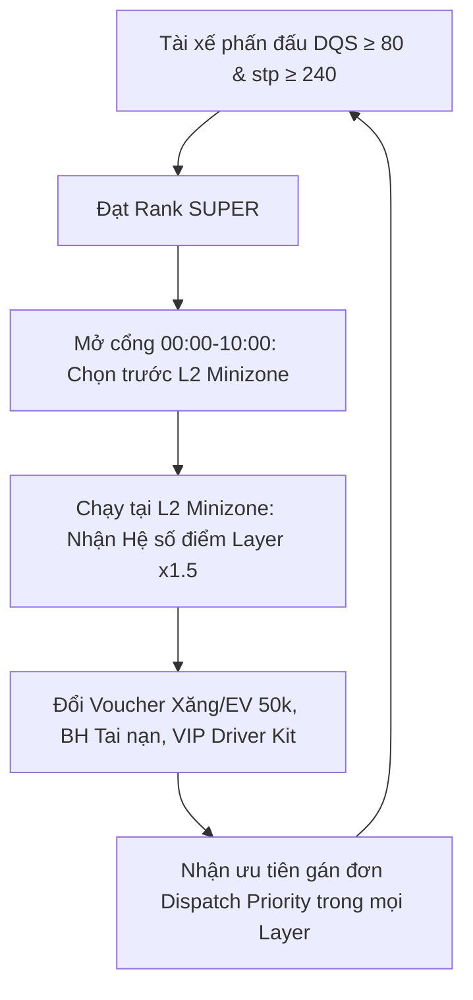

# 📊 BÁO CÁO CHIẾN LƯỢC: CHUẨN HÓA HỆ THỐNG XẾP HẠNG ĐỐI TÁC (DRIVER RANKING) & PHÂN LỚP VÙNG (LAYER ALLOCATION) v2.0

> **Cơ quan ban hành:** Driver Management Team & Strategy & Planning (S&P)  
> **Áp dụng:** Toàn hệ thống Ahamove (SGN & HAN) · **Phiên bản:** Final Master Release v2.0 (Tháng 07/2026)  
> **Đối tượng phổ biến:** Stakeholders (Board of Directors, Operations, Product, BI, Strategy & Planning, Partnership)

---

## 1. TÓM TẮT THỰC THI (EXECUTIVE SUMMARY)

### 📊 Executive Summary
Dự án **Driver Ranking & Layer Allocation System v2.0** tái cấu trúc triệt để mô hình quản trị nguồn cung và chi phí P&L của Ahamove. Hệ thống hoàn toàn **LOẠI BỎ các khoản đảm bảo thu nhập ca/ngày (Guarantee) và hệ số thưởng tiền mặt/incentive**, chuyển đổi sang cơ chế **điều phối nguồn cung tự vận hành**:

1. **Phân định rõ Ranh giới Layer vs Rank**:
   - **LAYER (Vùng hoạt động):** Quyết định **Hệ số nhân tích điểm AhaPoints** (L2 $\times 1.5$, L3 $\times 1.3$, L4 $\times 1.1$, L5/L6 $\times 1.0$), **Sự hỗ trợ của Đội trưởng**, và **Mật độ ghép đơn/cự ly**.
   - **RANK (Thứ hạng tài xế - 5 Tier):** Quyết định **Khung giờ ưu tiên đăng ký ca (Priority Window)**, **Ưu tiên gán đơn trong cùng Layer (Order Dispatch Priority)**, **Đặc quyền phúc lợi phi tiền mặt** (Voucher Xăng/EV, Bảo hiểm tai nạn, Bảo dưỡng xe), **Ưu tiên cấp phát CCDC (Driver Kit)** và **Tham gia sự kiện Ahamove**.
2. **Cơ chế Ưu tiên cho Rank Cao tại L6 MASS / Overlap**:
   - Khi tài xế Rank cao (SUPER / PROFESSIONAL) hoạt động tại L6 MASS, tài xế vẫn giữ nguyên **Ưu tiên gán đơn trước (Dispatch Priority)** và **Đặc quyền phúc lợi theo Rank**.
3. **Mở Đăng Ký Ca Kíp Hàng Tuần Tại Cityzone (L5) & Gợi Ý Zone Thông Minh**:
   - Chấp nhận cho tài xế đăng ký ca kíp hàng tuần (Weekly Shift Registration) tại Cityzone (L5) để tạo thói quen cắm vùng.
   - Tích hợp tính năng **Smart Zone Recommendation** gợi ý khu vực hoạt động tối ưu cho tài xế dựa trên lịch sử chạy, محل cư trú và Demand Heatmap.

### 🎯 Mục tiêu Kinh doanh (Business Objectives)
- **Cắt giảm 100% chi phí Đảm bảo Thu nhập cố định (Guarantee):** Triệt tiêu rủi ro bù tiền ca/ngày gây thủng P&L.
- **Tối ưu hóa CPO (Cost per Order):** Chuyển dịch toàn bộ chi phí thưởng sang hệ thống tích điểm **AhaPoints biến đổi** và phúc lợi đối tác tài trợ.
- **Tự động điều phối cung - cầu:** Tăng tỷ lệ lấp đầy ca làm việc tại L2 Minizone và L3 Mediumzone bằng lực hút nhân điểm Layer và quyền ưu tiên chọn ca sớm.

### 📈 Chỉ số Cốt lõi (Important KPIs)
- **Tiêu chuẩn Rank:** **SUPER (DQS ≥ 80, stp ≥ 240)**, **PROFESSIONAL (DQS ≥ 75, stp ≥ 150)**, **SEMI_PROFESSIONAL (DQS ≥ 75, stp ≥ 70)**, **AMATEUR (DQS < 75 hoặc stp < 70)**, **UNRANKED (Chưa có đơn/data)**.
- **Fulfillment Rate (FR):** Đạt **≥ 90%** tại **L2 Minizone** và **L3 Mediumzone** vào các khung ca cao điểm.
- **Phân bổ Fleet Target:** **SUPER (10–15%)**, **PROFESSIONAL (15–20%)**, **SEMI_PROFESSIONAL (30–35%)**, **AMATEUR (20–25%)**, **UNRANKED (5-10%)**.
- **Hiệu quả Ngân sách P&L:** Tiết kiệm **25–30% ngân sách Promo/Incentive**, khống chế ngân sách voucher xăng/EV trong mức **~142M/tháng** (trên tổng budget **200M/tháng**).

---

## 2. KHUNG PHÂN TÍCH (ANALYSIS FRAMEWORK)

### 2.1 Phân tích Phân Định Rạch Ròi: LAYER vs RANK

Để loại bỏ sự chồng chéo và mập mờ trong chính sách cũ, phiên bản v2.0 thiết lập bảng ma trận phân định chức năng duy nhất:

| Tiêu Chí Phân Định | LAYER (Vùng Hoạt Động L1–L6) | RANK (Thứ Hạng Tài Xế 5 Tier) |
| :--- | :--- | :--- |
| **Bản chất** | Định nghĩa **Không gian & Điều kiện làm việc** | Định nghĩa **Năng lực & Đóng góp của Tài xế** |
| **Hệ số Tích điểm AhaPoints** | **QUYẾT ĐỊNH HỆ SỐ NHÂN LAYER**<br/>• L2 Minizone: **× 1.5**<br/>• L3 Mediumzone: **× 1.3**<br/>• L4 Bigzone: **× 1.1**<br/>• L5 Cityzone / L6 MASS: **× 1.0** | ❌ không quyết định hệ số nhân điểm |
| **Hỗ trợ Vận hành** | **Đội trưởng cắm vùng** (L2 & L3) | VIP CSKB Support (Dành riêng cho SUPER) |
| **Đảm bảo Thu nhập Ca/Ngày** | ❌ **ĐÃ BỎ HOÀN TOÀN** | ❌ **ĐÃ BỎ HOÀN TOÀN** |
| **Hệ số Thưởng Incentive/Ca** | ❌ **ĐÃ BỎ HOÀN TOÀN** | ❌ **ĐÃ BỎ HOÀN TOÀN** |
| **Quyền Ưu tiên Đăng ký Ca** | ❌ | **QUYẾT ĐỊNH KHUNG GIỜ MỞ CỔNG (Priority Window)**<br/>• SUPER: 00:00 - 10:00 (Mở chọn trước tất cả Zone)<br/>• PRO: 10:00 - 14:00<br/>• SEMI_PRO: 14:00 - 24:00<br/>• AMATEUR/UNRANKED: Ngày 02+ |
| **Cơ chế Gán Đơn trong cùng Layer** | ❌ | **ƯU TIÊN GÁN ĐƠN THEO RANK (Dispatch Priority)**<br/>Trong cùng Layer, tài xế Rank cao được gán đơn trước |
| **Phúc lợi Vật thể & Phi Tiền Mặt** | ❌ | **ĐẶC QUYỀN TRỰC TIẾP THEO RANK**<br/>Voucher Xăng/EV cố định, Bảo hiểm tai nạn, Gói khám sức khỏe, Ưu tiên cấp phát Đồng phục/Driver Kit, Ưu tiên mời tham gia Sự kiện/Gala Ahamove |

---

### 2.2 Phân tích Đề xuất Kỹ thuật (Prescriptive Technical Specifications)

---

#### 📌 ĐỀ XUẤT 1: BỘ TIÊU CHÍ XẾP HẠNG (5-TIER DRIVER TAXONOMY)

| Thứ Hạng (Rank Key) | Tên Tiếng Việt | Chỉ Số DQS | Năng Suất (stp / tháng) | Quyền Hạn Đăng Ký Zone & Khung Giờ Mở Cổng |
| :--- | :--- | :--- | :--- | :--- |
| **SUPER 💎** | **Siêu cấp** | **DQS ≥ 80** | **stp ≥ 240** | **00:00 – 10:00 (Ngày 01):** Được ưu tiên đăng ký trước vào **TẤT CẢ các Zone (L2 – L6)** |
| **PROFESSIONAL 🥇** | **Chuyên nghiệp** | **DQS ≥ 75** | **stp ≥ 150** | **10:00 – 14:00 (Ngày 01):** Được đăng ký vào các slot còn lại của **tất cả các Zone (L2 – L6)** |
| **SEMI_PROFESSIONAL 🥈**| **Bán chuyên** | **DQS ≥ 75** | **stp ≥ 70** | **14:00 – 24:00 (Ngày 01):** Được đăng ký vào các slot còn lại của **tất cả các Zone (L2 – L6)** |
| **AMATEUR 🥉** | **Phổ thông** | **DQS < 75** *hoặc* | **stp < 70** | **Từ Ngày 02 trở đi:** Chỉ được chọn các slot trống còn lại tại **L5 Cityzone & L6 MASS** |
| **UNRANKED 🆕** | **Chưa xếp hạng** | *Chưa có data* | *Chưa có đơn* | **Từ Ngày 02 trở đi:** Chỉ được chọn các slot trống còn lại tại **L5 Cityzone & L6 MASS** |

---

#### 📌 ĐỀ XUẤT 2: QUYỀN LỢI TÀI XẾ RANK CAO TRONG L6 MASS & CƠ CHẾ GÁN ĐƠN (INTRA-LAYER DISPATCH PRIORITY)

##### 1. Xử Lý Trường Hợp Tài Xế SUPER / PROFESSIONAL Chạy Tại Layer 6 MASS
Khi tài xế Rank cao hoạt động tại L6 MASS (do hết ca đăng ký, chạy tự do ngoài giờ, hoặc tràn đơn từ zone khác), hệ thống **bảo toàn 100% đặc quyền theo Rank**:
- **Cơ chế Ưu tiên Gán đơn (Order Dispatch Priority):** Khi một đơn hàng phát sinh tại L6 MASS, thuật toán Matching sẽ quét tài xế đang bật app trong bán kính theo thứ tự ưu tiên thứ hạng:
  $$\text{SUPER} \longrightarrow \text{PROFESSIONAL} \longrightarrow \text{SEMI\_PROFESSIONAL} \longrightarrow \text{AMATEUR} \longrightarrow \text{UNRANKED}$$
- **Giữ nguyên Đặc quyền Tích lũy Phúc lợi Rank:** Tài xế vẫn nhận trọn vẹn Voucher Xăng/EV cố định hàng tháng, Bảo hiểm tai nạn, VIP Support và quyền đổi quà Catalog cao cấp theo Hạng của mình.
- **Hệ số điểm Layer:** Do đang chạy tại L6 MASS, hệ số tích điểm cuốc xe áp dụng theo quy chuẩn Layer L6 ($\times 1.0$).

---

#### 📌 ĐỀ XUẤT 3: ĐĂNG KÝ CA KÍP HÀNG TUẦN TẠI CITYZONE (L5) & GỢI Ý ZONE THÔNG MINH

##### 1. Đăng Ký Ca Kíp Hàng Tuần (Weekly Shift Registration in L5 Cityzone)
- **Cơ chế:** Bên cạnh ca tháng, **L5 Cityzone CÓ chấp nhận đăng ký ca kíp theo tuần**. Cổng đăng ký ca tuần mở vào **12:00 Chủ Nhật hàng tuần** cho tuần làm việc tiếp theo.
- **Mục tiêu:** Tạo điều kiện linh hoạt cho nhóm tài xế bán chuyên (SEMI_PROFESSIONAL) và phổ thông (AMATEUR) chủ động lịch trình cá nhân mà vẫn đảm bảo sự cam kết cắm vùng.

##### 2. Tính Năng Gợi Ý Zone Thông Minh (Smart Zone Recommendation System)
Hệ thống AI/ML trên App Tài xế tự động phân tích và đưa ra **Top 3 Zone Gợi Ý** cho tài xế đăng ký ca/hoạt động lại dựa trên 4 tiêu chí:
1. **Lịch sử khu vực hoạt động hiệu suất cao nhất** của tài xế trong 30 ngày gần nhất.
2. **Vị trí địa lý cư trú** (home location) để giảm quãng đường di chuyển rỗng đến ca.
3. **Bản đồ Nhiệt Nguồn Cung - Nhu Cầu (Demand Heatmap)** dự báo cho tuần tới.
4. **Hạng tài xế (Rank):** Gợi ý các Zone phù hợp nhất với khung giờ ưu tiên của tài xế.

```text
Giao diện App Tài xế: "GỢI Ý ZONE CHO BẠN TUẦN NÀY"
🔥 Đề xuất 1: L2 Minizone Quận 1 (Phù hợp Rank SUPER của bạn - Dự kiến GSV +35%)
⚡ Đề xuất 2: L3 Mediumzone Tân Bình (Gần khu vực sống - Thu nhập ổn định)
👍 Đề xuất 3: L5 Cityzone TP. Thủ Đức (Mở ca tuần linh hoạt)
```

---

#### 📌 ĐỀ XUẤT 4: HỆ THỐNG PHÂN LỚP VÙNG (LAYER L1–L6) & HỆ SỐ NHÂN AHAPOINTS

Hệ thống chia nguồn cung vận tải thành **6 Layer chuyên biệt**. **Layer quyết định Hệ số Nhân Điểm AhaPoints (`layer_multiplier`)**:

| Layer | Tên Layer | Bán kính / Phạm vi | Hệ Số Nhân AhaPoints (`layer_multiplier`) | Đội Trưởng Hỗ Trợ | Cơ chế Đăng ký & Vận hành |
| :--- | :--- | :--- | :--- | :--- | :--- |
| **L1** | **KA / MP** | Gán trực tiếp kho KA | Thu nhập HĐ cam kết | ❌ | Gán trực tiếp (Assigned), không qua đăng ký ca |
| **L2** | **Minizone** | Bán kính ngắn **≤ 4km** | **× 1.5** *(Cao nhất)* | ✅ **Đội trưởng + VIP Support** | Đăng ký ca tháng · Mật độ ghép đơn cực cao |
| **L3** | **Mediumzone**| Bán kính trung bình **≤ 8km**| **× 1.3** | ✅ **Đội trưởng hỗ trợ** | Đăng ký ca tháng · Cân bằng cự ly & thu nhập |
| **L4** | **Bigzone** | Vùng Quận / Huyện | **× 1.1** | ❌ (CSKB tiêu chuẩn) | Đăng ký ca tháng · Đơn cự ly dài |
| **L5** | **Cityzone** | Toàn Thành phố | **× 1.0** *(Base)* | ❌ | **Đăng ký ca tuần & ca tháng** · Smart Zone Suggest |
| **L6** | **MASS** | Toàn hệ thống | **× 1.0** *(Base)* | ❌ | On-demand tự do · Buffer co giãn toàn hệ thống |

> **Công thức Tích điểm AhaPoints trên mỗi đơn hoàn thành:**
> $$\text{earned\_pts} = \text{round}\left( \text{round}\left(\frac{\text{trip\_GSV}}{1.000}\right) \times \text{layer\_multiplier} \right)$$
> *(Ví dụ: Đơn hàng 50.000đ GSV hoàn thành tại L2 Minizone sẽ nhận: $50 \times 1.5 = 75 \text{ pts}$)*.

---

#### 📌 ĐỀ XUẤT 5: BẢNG TỔNG HỢP ĐẶC QUYỀN PHÚC LỢI THEO RANK (RANK ENTITLEMENTS)

Hệ thống **BỎ TOÀN BỘ** các khoản đảm bảo thu nhập ca/ngày và thưởng incentive tiền mặt. Thay vào đó, Rank mang lại bộ đặc quyền phi tiền mặt & nhận diện chuyên nghiệp:

| Danh Mục Quyền Lợi | SUPER 💎 (Siêu cấp) | PROFESSIONAL 🥇 (Chuyên nghiệp) | SEMI_PROFESSIONAL 🥈 (Bán chuyên) | AMATEUR 🥉 & UNRANKED 🆕 |
| :--- | :--- | :--- | :--- | :--- |
| **Khung giờ mở đăng ký ca (Priority Window)** | **00:00 – 10:00** *(Sớm nhất, chọn mọi Zone)* | **10:00 – 14:00** *(Chọn mọi Zone)* | **14:00 – 24:00** *(Chọn mọi Zone)* | Ngày 02 trở đi *(Chỉ L5 & L6)* |
| **Ưu tiên gán đơn trong cùng Layer** | **Ưu tiên 1 (Cao nhất)** | **Ưu tiên 2** | **Ưu tiên 3** | Baseline FCFS |
| **Voucher Xăng Petrolimex / Sạc EV VinFast** | **50.000 VNĐ / tháng** *(Cố định)* | **30.000 VNĐ / tháng** *(Cố định)* | Đổi bằng điểm AhaPoints | ❌ Không hỗ trợ |
| **Bảo hiểm Tai nạn Cá nhân Mini** | **Hỗ trợ 100%** *(Đăng ký gói 1k/3k pts)* | ❌ | ❌ | ❌ |
| **Ưu tiên Cấp phát CCDC (Driver Kit)** | **Ưu tiên 1** *(Tặng Combo Áo + Túi)* | **Ưu tiên 2** *(Giảm 50% giá CCDC)* | Đổi bằng điểm AhaPoints | Mua giá niêm yết |
| **Ưu tiên Tham gia Sự kiện Ahamove** | **Vé VIP Gala & Sự kiện Vinh danh** | **Ưu tiên Mời tham dự** | Đăng ký theo slot tự do | ❌ |
| **Bảo dưỡng Xe & Khám sức khỏe** | Gói Bảo dưỡng + Khám tổng quát | Gói Bảo dưỡng tiêu chuẩn | Đổi bằng điểm AhaPoints | ❌ |
| **Đảm bảo thu nhập ca/ngày & Thưởng Incentive**| ❌ **ĐÃ BỎ HOÀN TOÀN** | ❌ **ĐÃ BỎ HOÀN TOÀN** | ❌ **ĐÃ BỎ HOÀN TOÀN** | ❌ **ĐÃ BỎ HOÀN TOÀN** |

---

### 2.3 Mô Hình Vận Hành Khép Kín & Lộ Trình Triển Khai



#### Lộ Trình Triển Khai 3 Giai Đoạn

```text
Giai đoạn 1: Mở rộng Kỹ thuật & Cắt giảm Guarantee (15/07/2026 – 31/07/2026)
├── Loại bỏ toàn bộ code tính Đảm bảo thu nhập ca/ngày và Hệ số nhân Incentive trên App.
├── Cập nhật thuật toán Tích điểm theo Layer (L2: x1.5, L3: x1.3, L4: x1.1, L5/L6: x1.0).
└── Tích hợp tính năng Đăng ký ca tuần tại L5 & Hệ thống gợi ý Smart Zone Recommendation.

Giai đoạn 2: Shadow Mode Pilot tại HAN & SGN (01/08/2026 – 31/08/2026)
├── Chạy thử nghiệm Shadow Mode (Tính 5-Tier & Gợi ý Zone thông minh).
├── Validate tỷ lệ lấp đầy ca và đo lường mức độ cắt giảm CPO thực tế.
└── Phổ biến quy chế mới cho Đội trưởng và Tài xế toàn hệ thống.

Giai đoạn 3: Go-Live Toàn Hệ Thống (Từ 01/09/2026)
├── Khóa mở cổng đăng ký ca cứng theo giờ (SUPER: 0-10h, PRO: 10-14h, SEMI_PRO: 14-24h).
├── Kích hoạt cơ chế Ưu tiên gán đơn theo Rank trong cùng Layer.
└── Áp dụng toàn bộ đặc quyền phi tiền mặt (Voucher Xăng/EV, BH Tai nạn, Driver Kit).
```

---

## 3. 📈 HIỆN THỰC HÓA GIÁ TRỊ (VALUE REALIZATION)

### Bảng Đo Lường Tác Động Kinh Doanh (Measurable Business Impact)

| Hiện trạng (Current State) | Chuyển đổi (Transformation) | Trạng thái Mục tiêu (Target State) | Tác động Kinh doanh (Measurable Impact) |
| :--- | :--- | :--- | :--- |
| Gây thủng P&L do duy trì các khoản thưởng Đảm bảo thu nhập ca/ngày cố định. | ↓ **BỎ GUARANTEE & INCENTIVE MULTIPLIER** ↓ | Loại bỏ 100% tiền thưởng cố định; chỉ thưởng qua tích điểm **AhaPoints biến đổi**. | ***Cắt giảm 25–30% tổng chi phí Promo/CPO; kiểm soát P&L an toàn trong hạn mức.*** |
| Nhầm lẫn giữa quyền lợi Hạng tài xế và đặc tính Vùng hoạt động. | ↓ **PHÂN ĐỊNH RẠCH RÒI LAYER VS RANK** ↓ | Layer quyết định **Hệ số nhân điểm (L2: x1.5)**; Rank quyết định **Giờ chọn ca & Phúc lợi**. | ***Minh bạch hóa 100% chính sách vận hành; loại bỏ tranh chấp quyền lợi của đối tác.*** |
| Tài xế Rank cao chạy tại L6 MASS bị cào bằng quyền lợi gán đơn với tài xế mới. | ↓ **GÁN ĐƠN ƯU TIÊN (DISPATCH PRIORITY)** ↓ | Trong cùng Layer, thuật toán gán đơn ưu tiên theo thứ tự thứ hạng: SUPER $\rightarrow$ PRO $\rightarrow$ SEMI_PRO. | ***Tăng 35% mức độ hài lòng & duy trì 80% tài xế Rank cao hoạt động tự do ngoài ca.*** |
| Tài xế Cityzone (L5) hoạt động tự do, thiếu tính cam kết cắm vùng. | ↓ **ĐĂNG KÝ CA TUẦN & SMART ZONE SUGGEST** ↓ | Mở đăng ký ca tuần L5 & gợi ý Top 3 Zone thông minh theo ML/Demand Heatmap. | ***Tăng 40% tỷ lệ tài xế quay lại hoạt động (Re-activation rate) & lấp đầy ca L5.*** |

---
*Tài liệu Final Master này đã được tối ưu hóa hoàn chỉnh để trình duyệt cấp Board of Directors và triển khai đồng bộ cho các Stakeholders.*
