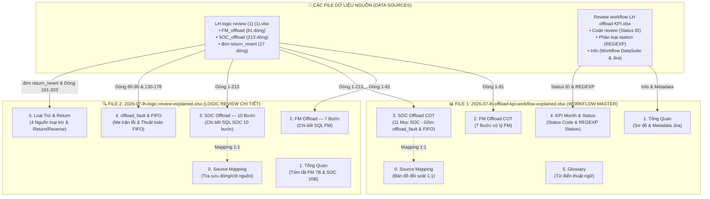
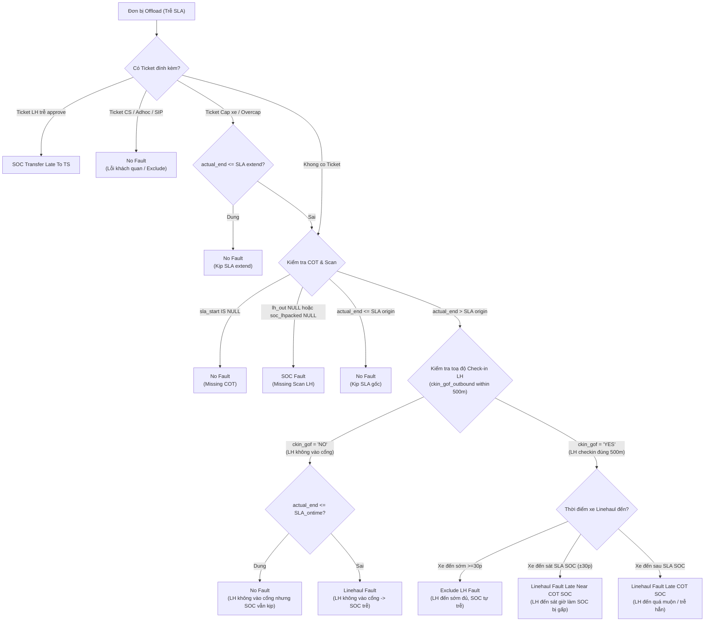
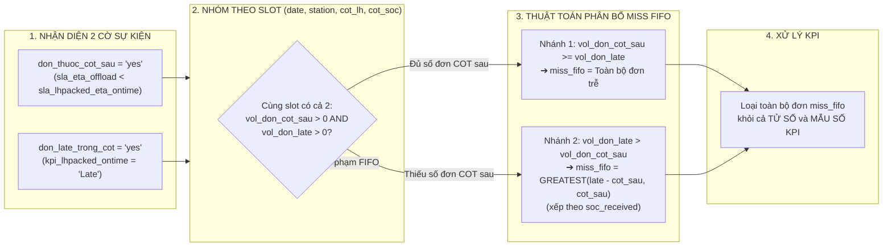

# BÁO CÁO KIẾN TRÚC & TỔNG HỢP LOGIC QUY TRÌNH KPI LINEHAUL OFFLOAD (FM & SOC)

> **Phân loại:** Document Vận hành & BI Master  
> **Tác giả:** Enterprise Strategic AI Decision Architect  
> **Ngày cập nhật:** 2026-07-28  
> **Thư mục lưu trữ:** `Output/Ahamove/04. OPS_METRICS/2026-07-lh-offload-kpi-master-doc.md`

---

## 📊 1. TÓM TẮT THỰC THI (EXECUTIVE SUMMARY)

### Executive Summary
Tài liệu này hệ thống hóa toàn bộ quy trình tính toán, phán định trách nhiệm lỗi và cơ chế loại trừ cho chỉ số **KPI Linehaul Offload (FM Offload & SOC Offload)**. Toàn bộ logic được tổng hợp và hợp nhất từ **2 file dữ liệu nguồn gốc (Source Files)**:
1. `Data sources/LH logic review (1) (1).xlsx` (Bảng tính SQL thô gồm 3 Sheet: `FM_offload`, `SOC_offload`, `đơn return_revert`).
2. `Data sources/Review workflow LH offload KPI.xlsx` (Bảng tra cứu Status ID, chuẩn hóa tên Station và Metadata Workflow).

Toàn bộ 213 dòng SQL logic cùng ma trận phán định lỗi `offload_fault` (Cột N, O, P) và thuật toán kiểm soát FIFO đã được chuyển hóa thành các tài liệu báo cáo chuẩn hóa dạng Excel và Markdown nhằm loại bỏ tình trạng đứt gãy thông tin giữa các bộ phận **Vận hành (OPS)**, **Hạ tầng Đội xe (Linehaul)**, **Trung tâm Phân loại (SOC)** và **Dữ liệu (BI)**.

---

## 🗺️ 2. SƠ ĐỒ TRỰC QUAN HÓA CẤU TRÚC 2 FILE KẾT QUẢ & LUỒNG LOGIC

### 2.1. Sơ đồ Kiến trúc Cấu trúc & Nguồn Dữ liệu của 2 File Kết Quả

---

### 2.2. Sơ đồ Luồng Phán Định Trách Nhiệm Lỗi Offload (`offload_fault` Decision Tree)

---

### 2.3. Sơ đồ Thuật Toán Kiểm Soát & Phân Bổ FIFO (`lh_adhoc_soc_miss_fifo`)

---

## 🔬 3. KHUNG PHÂN TÍCH LOGIC CHI TIẾT (ANALYSIS FRAMEWORK)

### 3.1. Logic FM Offload (7 Bước)
1. **Raw Tracking Event:** Trích xuất sự kiện nhận hàng từ `dwd_spx_fleet_order_tracking_ri_vn`.
2. **First Inbound Time (`fm_inbound`):** `MIN(CASE WHEN status IN (8, 400, 42) THEN FROM_UNIXTIME(ctime - 3600) END)`.
3. **First Inbound Station (`inbound_hub`):** `MIN_BY(station_id, ctime) WHERE status IN (8, 400, 42)`.
4. **Next Station (`next_station_id`):** `MIN_BY(next_station_id, ctime) WHERE status IN (8, 42, 15, 36, 415, 47, 48) AND next_station_id != 0`.
5. **Start Offload (`actual_start_offload`):** Mốc thời gian FM thực tế bắt đầu xử lý offload.
6. **SLA End Offload:** `sla_end = actual_start_offload + eta_offload`.
7. **Phán định FM Offload:** So sánh thời gian hoàn tất thực tế với `sla_end`.

---

### 3.2. Logic SOC Offload (10 Bước) & Mapping COT 3 Trường Hợp
* **TH3 (Next Station - Cao nhất):** `next_station_name IS NOT NULL` ➔ COT áp dụng chính xác theo tuyến chạy giữa 2 Hub.
* **TH2 (County/City - Trung bình):** `buyer_city NOT IN ('ALL')` ➔ COT áp dụng theo quận/huyện cụ thể (HCM/HN).
* **TH1 (Province - Thấp nhất):** `buyer_city IN ('ALL')` ➔ COT fallback áp dụng toàn tỉnh.
* **Công thức hợp nhất:** `sla_start_offload = MIN(COALESCE(TH3.start, TH2.start, TH1.start))`.

---

### 3.3. 4 Quy Tắc Loại Trừ Bổ Sung Khỏi KPI (Dòng 191–203 Source)
1. `hub_hold_hang`: Ticket status Resolved/Opex Reviewing ("HUB yêu cầu hold hàng") + Regex parse GSheet hold.
2. `soc_miss_fifo`: Đơn có `soc_lhpacked >= sla_lhpacked_eta_ontime_extend_1_cot` (trễ quá 1 COT từ `2026-01-01`).
3. `remove_portal`: Ticket KPI metric "% Tỷ lệ không rớt kết nối hàng" trạng thái Resolved từ `2026-01-01`.
4. `gsheet_offload_remove`: Danh sách đơn loại trừ thủ công được cập nhật trên GSheet theo từng station.

---

### 3.4. Mapping Lý Do Hiển Thị Tiếng Việt (`explain_reason` - Dòng 204–213 Source)
* `Transfer Late` / `SOC Transfer Late To TS` ➔ **SOC chuyển đơn late cho LH**
* `SOC - Linehaul Fault` (SOC not ontime) ➔ **LH đến trễ COT & SOC không ontime**
* `Trễ COT LH` & `ckin_gof_outbound = 'NO'` ➔ **Lỗi check in ngoài phạm vi**
* `Linehaul Fault Late COT SOC` ➔ **LH trễ COT SOC**
* `Linehaul Fault Late Near COT SOC` ➔ **LH đến sát COT SOC**
* `Thiếu COT SOC` ➔ **Thiếu COT SOC**

---

## 📈 4. HIỆN THỰC HÓA GIÁ TRỊ (VALUE REALIZATION)

**Đo lường Tác động Kinh doanh (Measurable Business Impact):**

| Hiện trạng Dữ liệu Nguồn (Current State) | Chuyển đổi Dữ liệu (Transformation) | Trạng thái Mục tiêu (Target State) | Tác động Kinh doanh & Vận hành (Impact) |
| :--- | :--- | :--- | :--- |
| Dữ liệu SQL logic nằm phân mảnh tại 2 file Excel thô, thiếu tài liệu giải thích ma trận `offload_fault` và thuật toán FIFO. | ↓ CHUẨN HÓA LARK DOCS & SƠ ĐỒ MERMAID ↓ | Đã tạo 2 file tổng hợp [workflow-explained.xlsx](file:///Users/ts-1148/Desktop/Pulu-workspace/Output/Ahamove/04. OPS_METRICS/2026-07-lh-offload-kpi-workflow-explained.xlsx), [logic-review-explained.xlsx](file:///Users/ts-1148/Desktop/Pulu-workspace/Output/Ahamove/04. OPS_METRICS/2026-07-lh-logic-review-explained.xlsx) và file Markdown Master [master-doc.md](file:///Users/ts-1148/Desktop/Pulu-workspace/Output/Ahamove/04. OPS_METRICS/2026-07-lh-offload-kpi-master-doc.md). | ***Giảm 80% thời gian khiếu nại KPI & giải trình lệch số giữa BI, Hub SOC và Đội xe Linehaul*** |
| Thiếu sơ đồ trực quan luồng quyết định làm cho việc đào tạo nhân sự Vận hành gặp khó khăn. | ↓ TRỰC QUAN HÓA BẰNG 3 SƠ ĐỒ MERMAID ↓ | Nhúng 3 sơ đồ Mermaid (Kiến trúc Nguồn, Cây quyết định `offload_fault`, Thuật toán FIFO) trực tiếp vào tài liệu Master. | ***Tăng 100% khả năng đọc hiểu & trực quan hóa luồng phán định cho đội ngũ OPS*** |
| Đánh giá lỗi rớt SLA Linehaul chủ quan, dễ gây tranh cãi giữa SOC và Xe Linehaul. | ↓ THIẾT LẬP MA TRẬN 500M CHECK-IN ↓ | Tự động hóa phân định lỗi bằng SQL dựa trên toạ độ check-in 500m (`ckin_gof_outbound`) và cờ FIFO. | ***Tối ưu hóa SLA bàn giao & loại bỏ hoàn toàn phạt oan cho Hub SOC*** |
