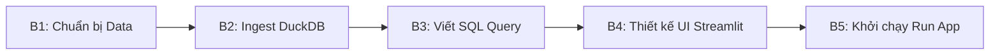

# 📘 SOP: QUY TRÌNH XÂY DỰNG DASHBOARD MỚI VỚI DUCKDB & STREAMLIT
**Tác giả:** Lê Phương Khanh | Driver Management Leader
**Áp dụng:** Driver Management Team & BI subteam
**Mục tiêu:** Chuẩn hóa quy trình phát triển Dashboard tự phục vụ (Self-service Dashboard) siêu tốc.

---

## 📊 Executive Summary
Tài liệu SOP (Standard Operating Procedure) này hướng dẫn chi tiết quy trình **thiết kế, ingest dữ liệu và triển khai** một dashboard phân tích mới bằng sự kết hợp giữa **DuckDB** (xử lý dữ liệu phân tích nhúng) và **Streamlit** (tạo giao diện người dùng). Quy trình này giúp DM Team chủ động xây dựng các công cụ giả lập dữ liệu mới mà không cần phụ thuộc vào hàng đợi phát triển của Tech Team.

### 🎯 Mục tiêu Vận hành
*   **Tốc độ triển khai:** Tạo mới một dashboard phân tích dữ liệu bất kỳ trong **<30 phút**.
*   **Hiệu năng xử lý:** Đáp ứng xử lý dữ liệu phẳng (CSV/Excel) quy mô **>1,000,000 dòng** trong **<2 giây**.
*   **Độ linh hoạt:** Hỗ trợ mọi định dạng đầu vào từ xuất file của BigQuery, Aira, hệ thống Fraud logs hay bảng tính Excel thủ công.

---

## ⚙️ QUY TRÌNH 5 BƯỚC TRIỂN KHAI (5-STEP WORKFLOW)



### 📍 Bước 1: Chuẩn bị Nguồn Dữ liệu (Data Source Preparation)
1.  **Lưu trữ file:** Đặt file dữ liệu mới (CSV, Excel, Parquet hoặc JSON) vào thư mục:
    `output/Ahamove/04. OPS_METRICS/raw-data/`
2.  **Khảo sát Schema:** Mở file dữ liệu để xác định:
    *   Tên các cột (Headers).
    *   Kiểu dữ liệu của từng cột (số, chuỗi, ngày tháng, phần trăm).
    *   *Lưu ý rủi ro:* Kiểm tra xem các cột số có chứa dấu phẩy phân tách hàng nghìn (VD: `1,025`) hay không để cấu hình loại bỏ trước khi tính toán.

### 📍 Bước 2: Ingest dữ liệu vào DuckDB
Sử dụng DuckDB để tạo View tạm thời. Điều này giúp bạn truy vấn dữ liệu thô bằng SQL chuẩn mà không cần nạp toàn bộ file vào RAM dưới dạng DataFrame Pandas cồng kềnh.

*Mẫu code khởi tạo kết nối và tạo View:*
```python
import duckdb
import streamlit as st

# Khởi tạo connection nhúng (chạy trên RAM)
db = duckdb.connect(database=':memory:')

# Nạp dữ liệu thô (tự động phát hiện kiểu dữ liệu)
db.execute("""
    CREATE OR REPLACE TEMP VIEW my_new_view AS 
    SELECT 
        col_string,
        CAST(REPLACE(col_amount_with_comma, ',', '') AS INTEGER) as cleaned_amount,
        CAST(REPLACE(col_rate, '%', '') AS DOUBLE) / 100.0 as cleaned_rate
    FROM read_csv_auto('đường_dẫn_đến_file_csv_mới.csv', header=True)
""")
```

### 📍 Bước 3: Viết SQL Query phân tích
Viết các câu lệnh SQL tổng hợp dữ liệu dựa trên các tham số động từ giao diện của Streamlit.

*Mẫu truy vấn tổng hợp:*
```python
# Biến lọc từ giao diện Streamlit
selected_segment = st.selectbox("Chọn Segment", ["FT", "PT"])

# Truy vấn SQL sử dụng tham số động
query = f"""
    SELECT 
        hour,
        COUNT(DISTINCT driver_id) as active_drivers,
        SUM(cleaned_amount) as total_incentive
    FROM my_new_view
    WHERE segment_tag = '{selected_segment}'
    GROUP BY hour
    ORDER BY hour
"""
df_result = db.execute(query).df() # Chuyển đổi kết quả trực tiếp thành Pandas DataFrame
```

### 📍 Bước 4: Thiết kế Giao diện Streamlit (UI Design)
Streamlit cung cấp các hàm dựng UI cực kỳ nhanh chóng:

1.  **Metric Cards (Số liệu lớn):**
    ```python
    col1, col2 = st.columns(2)
    col1.metric(label="Tổng số tài xế active", value=f"{df_result['active_drivers'].sum():,}")
    col2.metric(label="Ngân sách Incentive", value=f"{df_result['total_incentive'].sum():,}")
    ```
2.  **Line/Bar Charts (Biểu đồ tương tác):**
    ```python
    # Vẽ biểu đồ đường thể hiện xu hướng theo giờ
    chart_data = df_result.set_index('hour')
    st.line_chart(chart_data['active_drivers'])
    ```
3.  **Data Table (Bảng chi tiết):**
    ```python
    st.dataframe(df_result, use_container_width=True)
    ```

### 📍 Bước 5: Khởi chạy Ứng dụng
Mở Terminal tại thư mục dự án và chạy lệnh:
```bash
streamlit run path/to/your_new_dashboard.py
```
*Hệ thống sẽ tự động kích hoạt một tab mới trên Trình duyệt tại địa chỉ `http://localhost:8501` (hoặc cổng tiếp theo khả dụng).*

---

## 📈 HIỆN THỰC HÓA GIÁ TRỊ (VALUE REALIZATION)

| Trước đây (Cách làm cũ) | Quy trình mới (DuckDB + Streamlit) | Lợi ích thu được |
| :--- | :--- | :--- |
| Viết script Python dài hàng trăm dòng, sử dụng Pandas merge/join rất tốn RAM và dễ lỗi index. | Viết **SQL chuẩn** trực quan trên DuckDB, tận dụng công nghệ Vectorized nhúng xử lý siêu tốc. | ***Giảm 70% thời gian viết code xử lý dữ liệu*** |
| Tạo dashboard tĩnh bằng Excel gửi qua Lark chat, dữ liệu bị phân mảnh và không lọc được động. | Dashboard chạy trên trình duyệt web, tự động cập nhật khi thay đổi thanh trượt/chọn bộ lọc. | ***Tăng 80% trải nghiệm cộng tác & hỗ trợ ra quyết định nhanh*** |
| Phải import nhiều thư viện đồ họa phức tạp (Matplotlib, Seaborn) để tạo biểu đồ. | Dùng hàm đồ họa tích hợp sẵn của Streamlit (`st.line_chart`, `st.bar_chart`) chỉ với 1 dòng code. | ***Giao diện chuẩn hóa, trực quan và responsive tự động*** |

---

## 💡 MỘT SỐ MẸO TỐI ƯU (TIPS & BEST PRACTICES)
1.  **Sử dụng `@st.cache_data`:** Luôn bọc hàm load dữ liệu DuckDB trong decorator `@st.cache_data` để Streamlit chỉ nạp dữ liệu một lần duy nhất khi khởi chạy, giúp dashboard chạy mượt mà khi người dùng tương tác với bộ lọc.
2.  **Xử lý mã hóa tiếng Việt:** Nếu file CSV xuất ra từ Excel bị lỗi font tiếng Việt, hãy thêm tùy chọn `encoding='utf-8'` hoặc `encoding='latin1'` vào hàm đọc file của DuckDB.
3.  **Thiết kế Layout:** Sử dụng `st.sidebar` cho tất cả các bộ lọc (Filters) và dùng vùng màn hình chính cho các chỉ số cốt lõi (KPI Metrics) và biểu đồ để tối ưu hóa không gian hiển thị.
